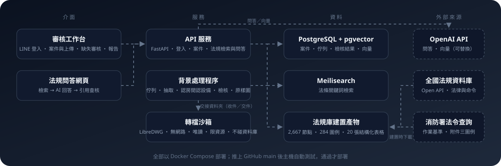

<p align="center">
  
</p>

<p align="center">
  <a href="#它做什麼">它做什麼</a> ・
  <a href="#主要功能">主要功能</a> ・
  <a href="#為什麼可以信">為什麼可以信</a> ・
  <a href="#系統組成">系統組成</a> ・
  <a href="#現況與未來">現況與未來</a> ・
  <a href="#開發者文件">開發者文件</a>
</p>

<p align="center">
  
  
  
  
  
</p>

把上傳的消防設備圖讀成房間與設備，逐條對照消防法規，列出缺失、依據條文與合規建議。給消防設備師與事務所用的審圖助手：系統負責翻條文、量距離、算數量，人負責判斷與簽證。

## 它做什麼

<p align="center">
  
</p>

1. **上傳圖檔** — 拖放 DWG／DXF；大型圖的配置頁、外部參考的建築底圖自動處理。
2. **分析圖面** — 認圖框與圖號、由牆柱門窗圍出房間並判斷種類；依消防署附件三圖例與圖塊字典認出設備。
3. **逐項檢核** — 水平距離、步行距離、數量、規格、管徑、依場所應設的設備，逐條對應法規條文。
4. **缺失與建議** — 每條缺失附依據與建議；條件不明時列出要補的資料；可逐條接受／退回，匯出報告。

## 主要功能

<table>
<tr>
<td width="50%" valign="top">

**📚 結構化法規庫**<br>
5 部消防法規與消防署審查作業基準拆到條／項／款／目，共 2,667 個節點、29 個場所代碼、284 個圖例；交叉引用自動解析，條文內的方框表格與 PDF 表格結構化成真正的表格。法規文字以官方 Open API 為準，修正後重建即可。

</td>
<td width="50%" valign="top">

**🤖 法規問答**<br>
先檢索再回答：條號直取、場所代碼展開、關鍵詞與向量檢索合併，85 題評測前 3 名命中 99%。AI 只能引用檢索到的條文，引用編號由程式逐一查核，無效或未經檢索的引用會在頁面警告。

</td>
</tr>
<tr>
<td valign="top">

**📐 圖面理解**<br>
DWG 在無網路、唯讀、限資源的沙箱容器轉檔；依圖框與圖號切圖，展開圖塊幾何，由牆柱門窗圍出房間，判斷廁所、樓梯、機電室、挑空等種類；配置頁與外部參考自動處理，同名底圖重新上傳時改用最新。

</td>
<td valign="top">

**✅ 逐項檢核**<br>
撒水頭、室內消防栓、揚聲器的水平距離；滅火器步行距離與數量；探測器數量；出口標示燈、避難方向指示燈、緊急照明；排煙口；連結送水管出水口；立管與末端查驗閥管徑；依場所判定應設設備並逐層比對。每條規則綁定法規節點。

</td>
</tr>
<tr>
<td valign="top">

**🗺️ CAD 原樣圖**<br>
樓層圖照原圖的圖層顏色、線型、線寬與文字顯示，可縮放平移；缺失標示疊在原圖上，一鍵「在圖上看」。大型圖在背景排隊產生，不影響新上傳的處理。

</td>
<td valign="top">

**🧑‍💼 審核工作台**<br>
LINE 登入與一次性邀請連結，不用密碼。案件、上傳、每個檔案一句白話說明；缺失逐條接受／退回並附備註；依據條文浮窗顯示全文；匯出 HTML 報告（可列印成 PDF）與 CSV。

</td>
</tr>
</table>

<p align="center">
  
</p>

## 為什麼可以信

- **只引用找得到的條文。** 法規文字來自法務部與消防署官方資料；AI 回答只能引用這次檢索到的條文，引用由程式查核，不靠模型自律。
- **每條缺失都綁法規節點。** 規則引擎每一條都指向具體的條／項／款，測試會確認節點存在；門檻經獨立稽核逐條對照原文。
- **不確定就說不確定。** 感度、天花板高度、場所類別等條件不明時以上下限判定：寬鬆仍不符才算不符，只在嚴格條件下不符的列「資料不足」並寫出要補什麼。
- **解讀分歧交給人。** 條文有不同讀法的地方集中在「法規解讀設定」，預設只降嚴重度並寫明兩種讀法，事務所可在工作台切換。
- **設備師把關。** 法定表格以草稿標示，只有消防設備師能改為已校對；系統輸出為輔助資訊，設計簽證依設備師判斷。

## 系統組成

<p align="center">
  
</p>

Python／FastAPI 服務加背景處理程序，DWG 轉檔隔離在沙箱容器；資料放 PostgreSQL（含 pgvector）與 Meilisearch；法規庫建置產物納入版控，部署直接用。全部以 Docker Compose 部署，推上 `main` 後主機自動在拋棄式容器跑完 500 多項測試，通過才部署，失敗自動換回前一版。

## 現況與未來

<p align="center">
  
</p>

**目前進度**：第 0 期法規庫已上線測試；第 1 期逐項檢核進行中，已用真實竣工圖實測並持續校正，部分圖塊對應與法規解讀待消防設備師確認。

**為什麼能長大**

- **法規修正可重建**：條文由官方資料建置，修正後重建即可；法定表格與現行條文不一致時建置會出警告，提醒重新校對。
- **規則逐條擴充**：每條規則獨立、綁定法規節點、附回歸測試，新規則一條一條加，不動既有規則。
- **圖塊字典可換事務所**：事務所自訂的圖塊名稱對應到附件三圖例，換事務所只要換字典，不改程式。
- **解讀設定可調**：送審單位或事務所對條文的讀法不同時，在設定切換，不用分叉程式。
- **AI 模型可替換**：問答與向量檢索走標準 API，引用查核在程式端，換模型不影響可信度機制。

**下一步**：消防設備師校對法定表格與問答答案測試集、更多規則與設備類別、正式網域。

## 開發者文件

| 文件 | 內容 |
|---|---|
| [docs/開發指南.md](docs/開發指南.md) | 本機開發、程式庫目錄、檢索評測 |
| [docs/法規庫.md](docs/法規庫.md) | 法規來源與節點、檢索、法定表格、API、法規問答網頁 |
| [docs/逐項檢核.md](docs/逐項檢核.md) | 圖面處理、認房間認設備、逐條規則、CAD 原樣圖、案件 API |
| [docs/工作台與登入.md](docs/工作台與登入.md) | 審核工作台、LINE 登入與邀請連結、帳號管理 |
| [docs/部署.md](docs/部署.md) | 主機部署與自動部署；腳本說明見 [deploy/oracle/README.md](deploy/oracle/README.md) |

<details>
<summary>本機快速開始</summary>

```
python -m venv .venv
.venv\Scripts\python -m pip install -e .[dev]
.venv\Scripts\python -m litian.lawdb.build
.venv\Scripts\python -m pytest -q
```

</details>

## 資料來源與授權

- 法律、命令條文：法務部全國法規資料庫 Open API（https://law.moj.gov.tw/api），依「政府資料開放授權條款－第 1 版」使用，須標示出處。
- 行政規則與附件（審查及查驗作業基準、附件三消防圖說圖示範例）：內政部消防署消防法令查詢系統（https://law.nfa.gov.tw）。
- 兩站皆聲明「與主管機關公布文字不同時，以主管機關公布為準」。本系統輸出為輔助資訊，設計簽證依消防設備師判斷。
